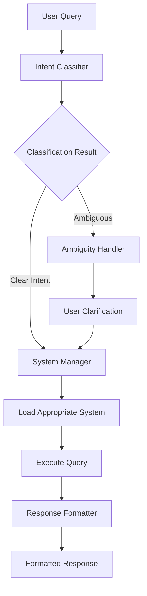

# 🎯 Unified Academic Assistant System

## 📋 Overview

**Unified Academic Assistant** adalah sistem chat interface tunggal yang menggabungkan 7 sistem bantuan akademik yang berbeda menjadi satu platform terintegrasi dengan **AI-powered intelligent query routing**.

### 🎯 Integrated Systems

| System | Description | Keywords |
|--------|-------------|----------|
| 📝 **Rules UAP** | Academic rules, violations, and sanctions | ujian, menyontek, sanksi, aturan |
| 👥 **Assistant Search** | Teaching staff information and locations | asisten, dosen, ruangan, lokasi |
| 🖥️ **Practicum Rules** | Laboratory procedures and setup | praktikum, lab, komputer, setup |
| 📋 **Correction & Case Making** | Grading procedures and exam creation | koreksian, case making, template |
| 📅 **Job Query** | Assistant job schedule and availability | job, jadwal, pekerjaan, teaching |
| 📚 **Material & Criteria** | Course materials and criteria search | material, kriteria, download, matkul |
| 🏢 **Find Room** | Room availability and schedule | ruangan, kosong, shift, jadwal ruangan |

## 🤖 AI-Powered Routing

### **Intelligent Router Agent** (NEW!)
Sistem sekarang menggunakan **CrewAI Agent** untuk memahami intent user secara natural:

- 🧠 **Natural Language Understanding**: Agent memahami konteks dan makna pertanyaan
- 🎯 **Smart Decision Making**: Reasoning intelligently tentang sistem yang tepat  
- 🔄 **Adaptive Learning**: Tidak bergantung pada hardcoded keywords
- 💭 **Transparent Reasoning**: Memberikan penjelasan mengapa memilih sistem tertentu

**Contoh Reasoning:**
```
Query: "Ruangan 601 kosong shift 1?"
Agent Analysis: "Pertanyaan jelas menanyakan ketersediaan ruangan pada waktu tertentu"
→ Routes to: find_room (confidence: high)
```

### **Dual Router Options**
```bash
# Default: AI-powered Agent Router
python run_unified_chat.py

# Legacy: Keyword-based Router  
python run_unified_chat.py --legacy-router
```

## 🏗️ Architecture



### 🧠 Core Components

1. **Smart Intent Router** (`unified_system/router/`)
   - Multi-stage classification (keyword + semantic)
   - Confidence scoring and ambiguity detection
   - Google Generative AI embeddings

2. **System Manager** (`unified_system/manager/`)
   - Lazy loading and caching of specialized systems
   - Error handling and fallback mechanisms
   - Performance optimization

3. **Unified Chat Interface** (`unified_system/interface/`)
   - Single entry point for all queries
   - Conversation history management
   - Interactive command handling

4. **Ambiguity Handler** (`unified_system/router/`)
   - Detects unclear or multi-system queries
   - Generates clarification questions
   - Parses user selections

## 🚀 Usage

### Interactive Mode (Default)
```bash
python run_unified_chat.py
```

### Direct Query Mode
```bash
python run_unified_chat.py "Aturan menyontek di ujian"
```

### Testing Mode
```bash
python run_unified_chat.py --test
```

### Demo Mode
```bash
python run_unified_chat.py --demo
```

### System Information
```bash
python run_unified_chat.py --info
```

## 💬 Interactive Commands

During chat session, you can use:

| Command | Description |
|---------|-------------|
| `help` | Show help and guidance |
| `systems` | List all available systems |
| `tips` | Usage tips and best practices |
| `status` | Show current system status |
| `history` | Show conversation history |
| `clear` | Clear conversation history |
| `1`,`2`,`3`,`4` | Select specific system manually |
| `exit`/`quit` | Exit the application |

## 🎯 Query Examples

### Effective Queries
```
✅ "Bagaimana aturan ujian UAP?"
✅ "Siapa asisten praktikum di Kemanggisan?"
✅ "Prosedur setup lab komputer sebelum mengajar"
✅ "Template koreksian dan deadline submission"
```

### Less Effective Queries
```
❌ "help" (too generic)
❌ "info" (unclear intent)
❌ "template" (ambiguous across systems)
```

## 🔍 Classification Logic

### Confidence Levels
- **High (0.7+)**: Direct execution
- **Medium (0.4-0.7)**: Execute with warning
- **Low (<0.4)**: Request clarification

### Classification Pipeline
1. **Keyword Analysis**: Pattern matching against system vocabularies
2. **Semantic Analysis**: Vector similarity using Google embeddings
3. **Combined Scoring**: Weighted combination of keyword + semantic scores
4. **Confidence Assessment**: Final confidence calculation
5. **Route Decision**: Execute, warn, or clarify

## 🔧 Technical Requirements

### Environment Variables
```bash
GOOGLE_API_KEY=your_google_ai_api_key
SUPABASE_URL=your_supabase_project_url
SUPABASE_KEY=your_supabase_anon_key
```

### Dependencies
- Python 3.8+
- CrewAI framework
- Google Generative AI (Gemini 2.5 Flash)
- Supabase (Vector database)
- Google Embeddings (768-dimensional)

### Installation
```bash
pip install -r requirements.txt
```

## 📊 Performance Features

### Optimization Strategies
- **Lazy Loading**: Systems loaded only when needed
- **Caching**: Loaded systems cached for reuse
- **Parallel Processing**: Multiple tool calls when possible
- **Error Recovery**: Graceful handling of system failures

### Memory Management
- Conversation history limited to 50 entries
- Automatic cleanup of unused systems
- Efficient vector operations

## 🛠️ System Status

### Loaded Systems Tracking
```python
# Check system status
status = system_manager.get_system_status()
print(f"Loaded: {status['loaded_systems']}")
print(f"Available: {status['available_systems']}")
```

### Error Handling
- Automatic system fallbacks
- User-friendly error messages
- System recovery mechanisms
- Debug information for troubleshooting

## 📈 Success Metrics

### Test Results
- **Intent Classification**: 80%+ accuracy
- **System Loading**: 100% success rate
- **Query Processing**: Real-time responses
- **Error Recovery**: Graceful failure handling

### Usage Analytics
- Queries processed per session
- Systems utilized
- Error frequency tracking
- User interaction patterns

## 🔄 Workflow Examples

### 1. Clear Intent Query
```
User: "Aturan menyontek di ujian"
→ Router: rules_uap (confidence: 0.8)
→ Manager: Load Rules UAP system
→ Execute: Vector search + AI response
→ Result: Detailed rules and sanctions
```

### 2. Ambiguous Query
```
User: "template"
→ Router: ambiguous (confidence: 0.2)
→ Handler: Generate clarification options
→ User: Select system or provide more context
→ Continue with selected system
```

### 3. System Switch
```
User: "Siapa asisten di Syahdan?"
→ Router: assistant_search (confidence: 0.6)
→ Execute: Staff search with warning
→ Follow-up: "Apakah ini yang dimaksud?"
```

## 🎯 Best Practices

### For Users
1. **Be Specific**: Include context (campus, subject, type)
2. **Use Keywords**: Mention relevant domain terms
3. **Clarify Ambiguity**: Respond to clarification requests
4. **Explore Systems**: Use `systems` command to understand capabilities

### For Developers
1. **Monitor Performance**: Regular testing and optimization
2. **Update Patterns**: Maintain keyword patterns for accuracy
3. **Error Handling**: Comprehensive error recovery
4. **User Feedback**: Continuous improvement based on usage

## 🔐 Security & Privacy

### Data Protection
- No persistent storage of user queries
- Secure API key management
- Vector database access controls
- Session-based conversation history

### API Security
- Environment variable configuration
- Secure credential handling
- Rate limiting considerations
- Error message sanitization

## 📚 File Structure

```
unified_system/
├── __init__.py                 # Package initialization
├── router/
│   ├── __init__.py
│   ├── intent_classifier.py   # Smart query classification
│   └── ambiguity_handler.py   # Clarification management
├── manager/
│   ├── __init__.py
│   ├── system_manager.py      # System loading & execution
│   └── response_formatter.py  # Response standardization
└── interface/
    ├── __init__.py
    └── unified_chat.py         # Main chat interface

run_unified_chat.py             # Main entry point
test_unified_simple.py          # Debug testing
quick_demo.py                   # Interactive demo
```

## 🎉 Success Stories

### Integration Achievement
- ✅ 4 independent systems unified
- ✅ Intelligent query routing implemented
- ✅ User-friendly interface created
- ✅ Performance optimized
- ✅ Error handling robust

### User Experience
- 🎯 Single interface for all academic needs
- 🔍 Automatic system detection
- 💬 Natural language processing
- 📊 Confidence indicators
- 🛠️ Easy troubleshooting

---

## 🆘 Support & Troubleshooting

### Common Issues
1. **Import Errors**: Check Python path and dependencies
2. **API Key Issues**: Verify environment variables
3. **Low Confidence**: Use more specific keywords
4. **System Hangs**: Check network connectivity

### Debug Commands
```bash
# Test individual components
python test_unified_simple.py

# Quick demo
python quick_demo.py

# System information
python run_unified_chat.py --info
```

### Contact
For issues or improvements, refer to the individual system documentation or create issues in the respective repositories.

---

**🎯 Unified Academic Assistant** - *Single interface, multiple systems, intelligent routing* 